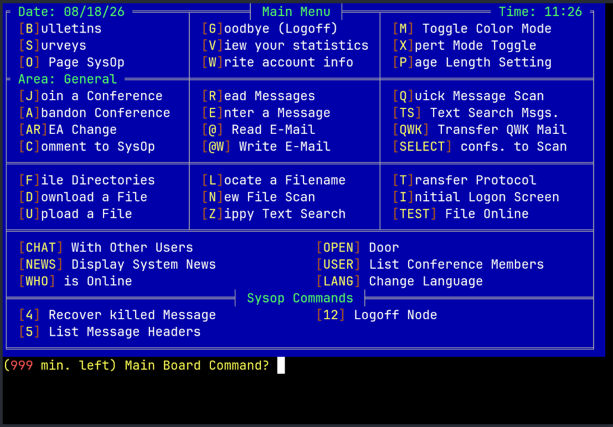
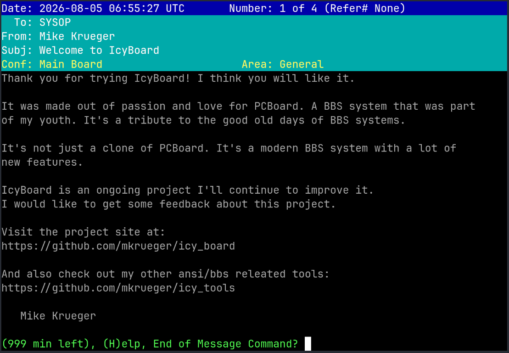
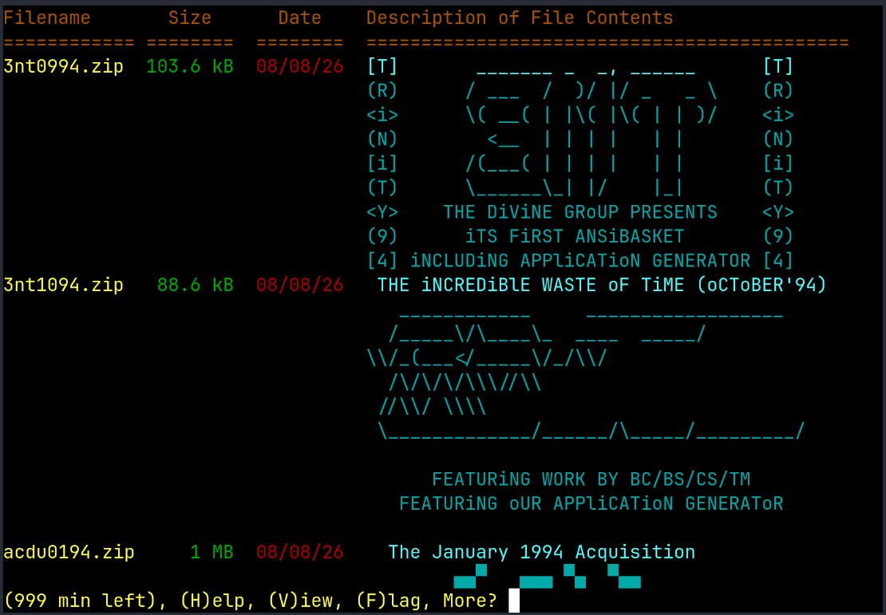
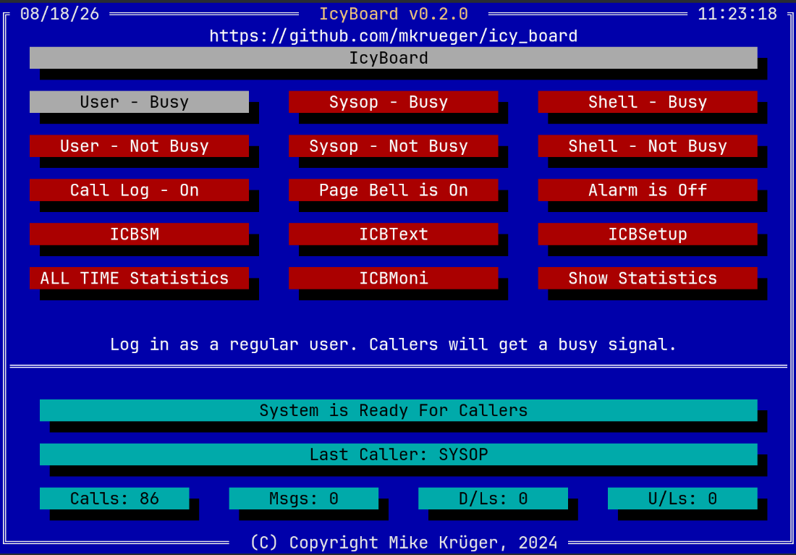
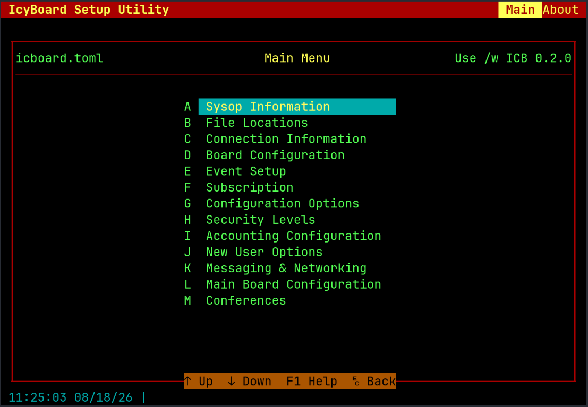
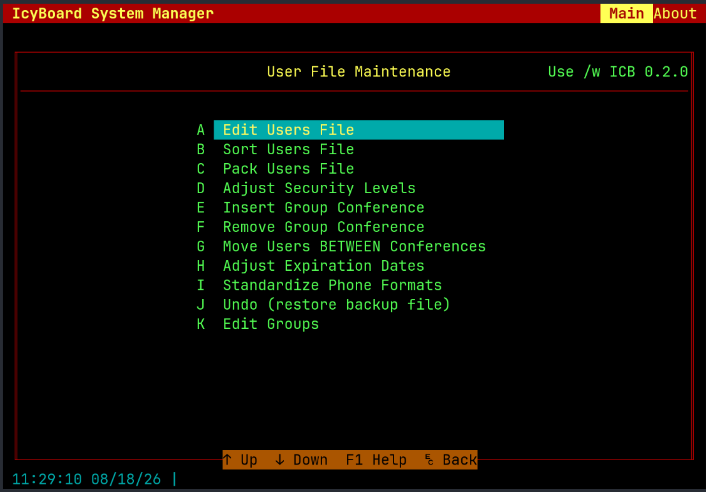
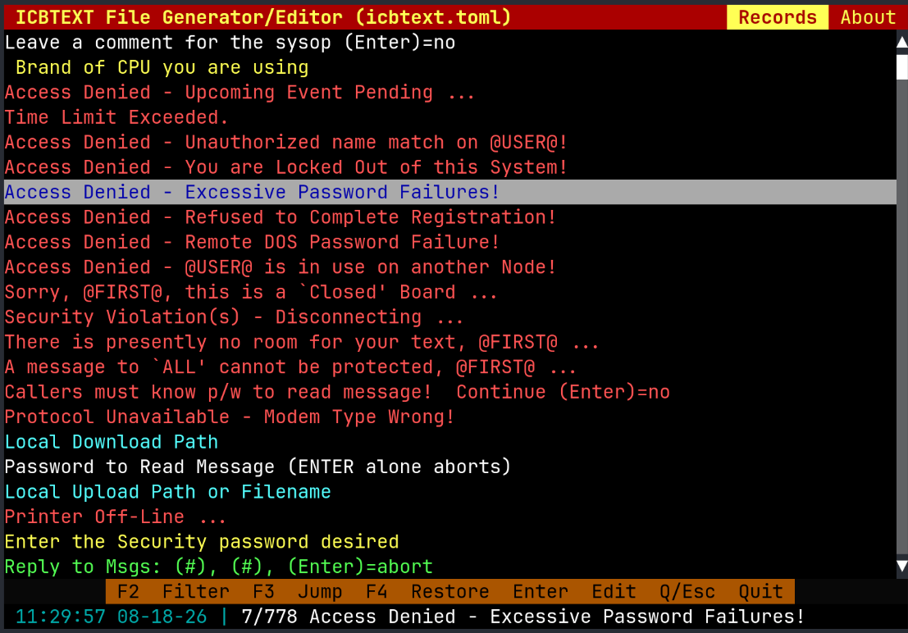

# Icy Board

Icy Board is a PCBoard-compatible bulletin board system for current machines.
It preserves the command set, `@` macros, display files, conferences and PPE
runtime that made a PCBoard installation its own, while replacing the DOS-era
server underneath them with a native Rust application for Linux, macOS,
Windows and the Raspberry Pi.

This is not PCBoard in an emulator and not a generic BBS wearing a PCBoard
theme. Existing callers should recognize the board, existing PPEs are expected
to run, and the setup and maintenance tools follow the original utilities. At
the same time, a sysop gets telnet, SSH and WebSocket listeners, long file
names, UTF-8, JAM message bases, modern password hashing, FTN over BinkP and
configuration files that can be versioned and edited as text.



## What works today

Icy Board is in beta, but it is a running board rather than a framework or a
mock-up. It can:

- take local, telnet, SSH and WebSocket callers on multiple nodes
- create users, enforce security and access expressions, and manage users and
  groups with `icbsm`
- split a conference into several named message areas, each with its own JAM
  base, access rule and optional FTN area tag
- give every caller a personal mail inbox outside the public conference areas;
  `@` reads it, `@W` writes mail and `Y` includes it in the personal-mail scan
- search, enter, read and scan messages, including QWK/QWKE and private messages
- manage file areas, extract `FILE_ID.DIZ`, import old DIR files, enforce
  transfer limits and run external transfer protocols
- execute PPEs, compile and decompile PPL, and provide diagnostics, completion,
  navigation and formatting through the PPL language server
- scan, poll and toss FTN mail as a leaf or point over BinkP
- run timed events and expose board maintenance as command-line tools suitable
  for cron and scripts

The compatibility target is PCBoard 15.4. The implementation is checked
against its source and against a real copy running under DOSBox, including
prompts and edge cases rather than only command names.

Compatibility is broad, not absolute:

| Surface | Compatibility |
| :--- | :--- |
| Caller commands and prompts | All user commands resolve; the remaining differences are tracked command by command. |
| PPE runtime | Existing PPEs are expected to run. DOS, assembler and direct access to old binary databases are outside that contract. |
| Display files and `@` macros | PCBoard/ANSI/Avatar/RIP files and the large majority of macros work, with UTF-8 available alongside CP437. |
| Configuration | Imported into TOML and edited with Icy Board tools; compatibility files are generated where old PPEs need them. |
| Message and file storage | Deliberately modern formats. JAM replaces PCBoard message bases; SQLite-backed file areas replace DIR databases. |

The exact status is documented rather than hidden behind the word “beta”:

- [Feature status](docs/feature_parity.md) — every PCBoard command and major subsystem
- [Known limitations](docs/known_limitations.md) — what is missing before moving a real board
- [Differences and improvements](docs/differences.md) — deliberate departures and why they exist
- [Compatibility audits](compat/README.md) — options, commands and the PCBoard oracle

Serial ports, modem control, FOSSIL drivers, DOS shelling and printer support
are intentionally out of scope.

## Better where DOS no longer needs to win

Compatibility is the baseline, not a ban on improvements:

| PCBoard constraint | Icy Board |
| :--- | :--- |
| DOS, modem and fixed node files | Native processes with local, telnet, SSH and WebSocket sessions |
| Short, drive-bound paths | Long file names and portable paths relative to the board root |
| CP437-only content | CP437 compatibility plus explicit UTF-8 support |
| Plain-text passwords | Argon2id or bcrypt hashes, with an opt-in compatibility fallback |
| One numeric security level | Security level, groups and age expressions |
| One message base per conference | Several named message areas per conference, without breaking old PPE calls |
| Private messages mixed into conferences | A personal mail inbox with `@`/`@W` and `Y`-scan integration |
| Proprietary message and DIR formats | JAM messages and richer SQLite-backed file metadata |
| Frozen PPL and closed tooling | Versioned PPL 3.50/4.00 additions, records and board objects, plus compiler, decompiler, formatter, language server and tree-sitter grammar |
| Setup tied to a DOS console | Familiar TUIs that also work over SSH, plus scriptable maintenance commands |

See [Differences and improvements](docs/differences.md) for the compatibility
cost of each change.

### Conferences are no longer one message base

PCBoard tied a conference to one message base. Icy Board keeps the conference
as the caller-facing group but lets it contain several named message areas. A
caller can move between them without joining another conference, scans cover
the selected areas, and each area can carry its own access expression and FTN
area tag. Old PPE calls still address the default area; PPL 4.00 adds
`MSGAREAID`, `AreaId()` and board objects for code that wants to be area-aware.

### Personal mail has an inbox

Private person-to-person mail no longer has to live among conference messages.
Each caller has a view into the separate personal JAM mail base. `@` opens the
inbox, `@W` writes to another user or alias, the login mail check can lead into
it, and `Y` reports waiting inbox mail alongside conference mail.

### PPL can evolve without abandoning PPEs

Language version 3.50 adds typed constants and enums, variable and array
initializers, bracket indexing, compound assignments, `REPEAT` and `LOOP`, and
routines passed as parameters. Language version 4.00 adds
real `BEGIN ... END` blocks, `EXIT`, records and record literals, member access,
board objects, message-area identifiers and overloaded built-ins. Features that
need stored record layouts or routine references use runtime 4.01; classic
source can stay on its original language and runtime version. Independently of
the selected language, the compiler resolves routines before code generation,
accepts `RETURN value`, checks declarations against implementations and reports
many mistakes the original compiler silently accepted.

## What it looks like

| | | |
| :---: | :---: | :---: |
|  |  |  |
| The message reader | A file listing, descriptions read out of each archive | The call waiting screen the sysop sees |
|  |  |  |
| `icbsetup` — the board | `icbsm` — users and groups | `mkicbtxt` — every prompt |

The configuration tools are TUIs, so they work over SSH.

## Start a board

```sh
icbsetup create mybbs     # writes a complete board into mybbs/
cd mybbs
icboard --localon         # logs you in as the sysop, telnet on port 1337
```

Prebuilt archives are on the
[releases page](https://github.com/mkrueger/icy_board/releases); building from
source needs nothing but a [Rust toolchain](https://rustup.rs). See
[INSTALL.md](INSTALL.md) for both, and for the list of programs — the board is a
set of command line tools, not one binary.

An existing PCBoard installation can be brought over. The importer only reads
the original:

```sh
icbsetup import /path/to/PCBOARD.DAT mybbs
```

An import is a migration starting point, not a claim that arbitrary drive
layouts and third-party PPE configuration can be translated without review.
Use `--dry-run`, map old drives explicitly and run the path checker before
starting the board. The [migration guide](docs/migration.md) walks through it.

## Tools

Icy Board is a small suite rather than one oversized executable:

| Program | Purpose |
| :--- | :--- |
| `icboard` | Board server, local session and call-waiting screen |
| `icbsetup` | Create, import, configure and validate a board |
| `icbsm` | Users, groups, bulk edits, sorting and packing |
| `mkicbtxt`, `mkicbmnu` | System-text and menu editors |
| `icbfile` | Import and maintain file areas |
| `icbmailer` | FTN scan, poll and toss |
| `pplc`, `ppld`, `ppl-lsp` | PPL compiler, decompiler and language server |

## Documentation

The **handbook** is the long form — installation, running a board, events, the
FTN mailer, customizing, and a complete PPL reference. It is built from
[docs/source](docs/source) and ships as a PDF with each release.

```sh
cd docs && make latexpdf     # or: make html
```

The [Markdown documentation index](docs/README.md) separates guides from
compatibility references and PPL/tooling material. Common starting points:

| | |
| :--- | :--- |
| [Getting started](docs/gettingstarted.md) | Create, configure and test a board |
| [Migrating from PCBoard](docs/migration.md) | Dry-run import, drive maps, PPE review and validation |
| [Differences and improvements](docs/differences.md) | What changed, why, and the compatibility cost |
| [File areas](docs/icbfile.md) | Importing and maintaining a file base |
| [PPL](docs/ppl.md) · [PPLC](docs/pplc.md) · [New in PPL](docs/new_ppl.md) | The language, its compiler, and what 4.0 added |
| [Feature status](docs/feature_parity.md) · [Known limitations](docs/known_limitations.md) | Compatibility details |

PPL has editor support for VS Code, Zed, Helix and Neovim. Highlighting comes
from the [tree-sitter grammar](crates/tree-sitter-ppl), while diagnostics,
completion, hover and navigation come from the `ppl-lsp` language server.

| Editor | How it is installed |
| :--- | :--- |
| [VS Code](editors/vscode) | `code --install-extension ppl-vscode-<version>-<platform>.vsix`, taken from a [release](https://github.com/mkrueger/icy_board/releases). The platform packages carry the server. |
| [Zed](https://github.com/mkrueger/zed-ppl) | Clone the extension and run `zed: install dev extension` on the clone. It fetches the server from the newest release by itself. |
| Helix, Neovim | `tools/setup-editor.sh` from a source checkout builds the grammar and the server and writes the configuration. |
| Anything else with LSP | Point it at `ppl-lsp` for `.pps`; it talks over stdio and takes no arguments. |

[Editor installation](INSTALL.md#ppl-in-your-editor) has the details, and the
[PPL editor overview](docs/ppl.md#editors) shows the same project in VS Code,
Zed and Helix.

## Where it came from

It started as a port of Adrian Studer's [ppld](https://github.com/astuder/ppld),
a PPE decompiler, written to learn Rust. Decompiling PPEs turns out to need a
board to run them against, and a general-purpose runtime does not help because
PPEs are specific to PCBoard down to the last data structure. So the decompiler
needed a BBS, and the BBS is this.

The leaked PCBoard 15.3 sources and a copy of the 15.4 beta running under
DOSBox settle the arguments about what correct means — see
[compat/](compat/README.md) for how that oracle is driven.
For compatibility check I've used an AI testing all commands of icy_board inside dosbox-x to ensure that PPE kbdstuf approach for extending pcboard doesn't fail in icy_board. 

Started the project back ~2018 long before AI was a thing - but these days it really helps improving software development :).
(As well as writing docs)


## License

Apache 2.0, see [LICENSE](LICENSE).
