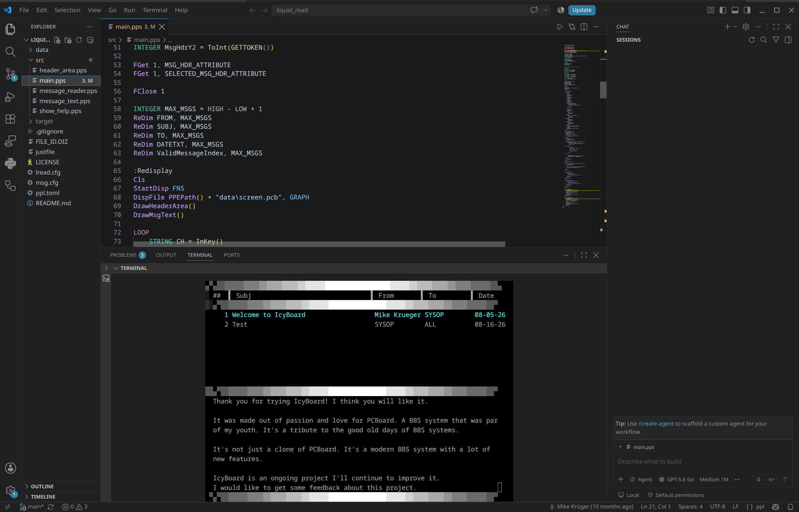
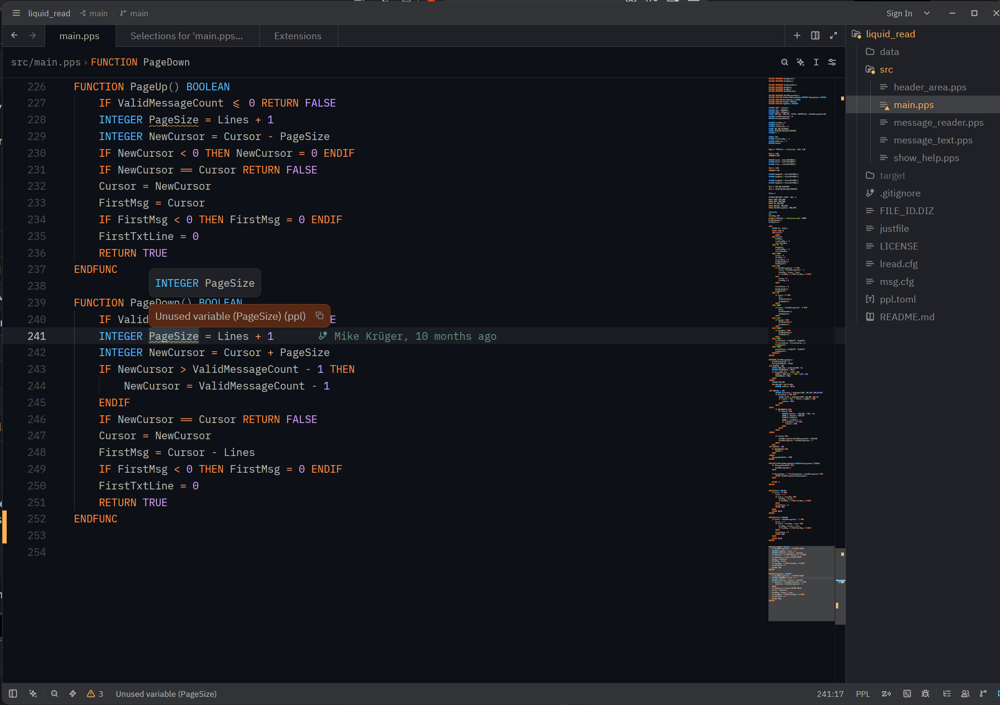
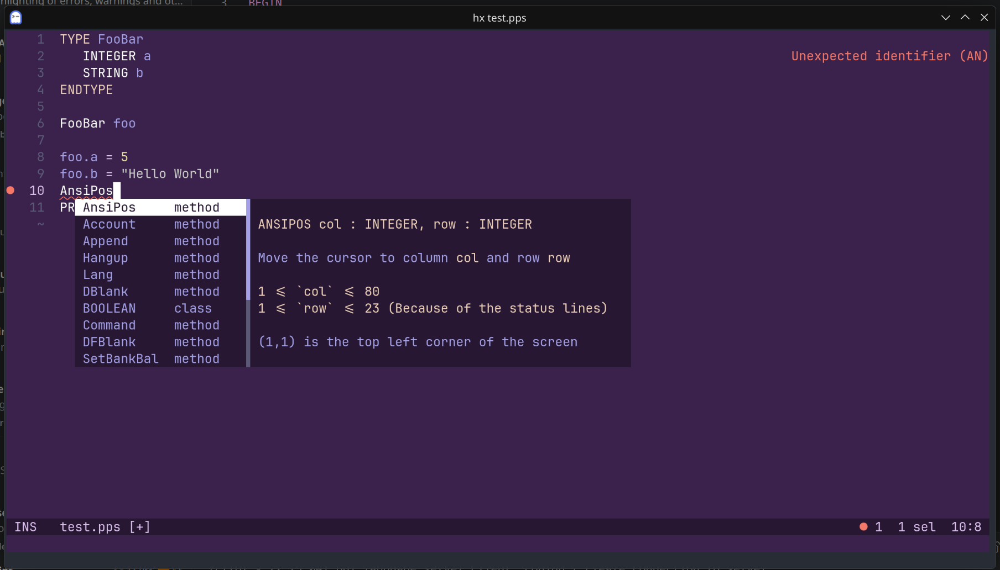

# PPL

PPL is PCBoard's extension language; a compiled program is a PPE. Icy Board
keeps PPE compatibility as a first-class part of the board and supplies the
toolchain that was missing from the original ecosystem:

| Tool | Purpose |
| :--- | :--- |
| Icy Board runtime | Runs existing PPEs against the board APIs callers and scripts expect. |
| `pplc` | Compiles a `.pps` source or a `ppl.toml` project to PPE. |
| `ppld` | Decompiles and disassembles PPEs, including old anti-decompiler patterns. |
| `ppl-lsp` | Diagnostics, completion, hover, signatures, navigation, references and formatting over LSP. |
| `tree-sitter-ppl` | Highlighting, locals, folding, indentation and syntax trees for editors. |

Existing PPEs that use documented PPL and PCBoard APIs are expected to run. A
failure is a compatibility bug. Direct access to PCBoard's binary databases,
DOS and assembler calls, drive-letter assumptions and reads of a plain-text
password cross the compatibility boundary described in
[Differences and improvements](differences.md).

The compiler supports the PCBoard language and Icy Board's versioned additions.
It is deliberately stricter where the original compiler silently accepted a
type or declaration mismatch; warnings are intended to expose ambiguous old
source without changing the generated program unnecessarily.

Old source and data files do not have to be converted: `pplc --cp437` reads
CP437 and the runtime reads legacy display files. `icbsetup ppe-convert` is for
projects that deliberately move their editable text to UTF-8; make a backup and
convert one PPE tree at a time because an arbitrary plugin directory may also
contain binary data.

Detailed references:

- [PPL compiler](pplc.md) — projects, command-line options, output and language versions
- [New in PPL](new_ppl.md) — language additions beyond PCBoard
- [PPE format](ppe_format.md) — binary format for tooling authors
- [Editor installation](../INSTALL.md#ppl-in-your-editor) — VS Code, Zed, Helix and Neovim

## Decompiler

The first decompiler was based on Adrian Studer's
[ppld](https://github.com/astuder/ppld). The current implementation is a
rewrite: it disassembles the PPL machine language and reconstructs an AST from
the instruction stream. That makes old PPEs inspectable when a migration needs
to find hard-coded paths, direct database access or other assumptions.

* PPE 3.40 Support
* Full reconstruction of IF/THEN, SWITH, WHEN etc.
* It tries to do some name guessing based on variable usage.

The source is written for the current language, whatever runtime the PPE was built
for, so it goes straight back into `pplc`. It opens with a `;$LANGVERSION` line that
names that language, and the instruction that ends a program is printed as `EXIT`
rather than `END`, because from 400 on `END` closes a `BEGIN ... END` block.
`--lang-version` writes for an older language instead, which is what the original
tooling needs; it also limits the reconstruction to the loops that language has, so
below 350 a `REPEAT`/`LOOP` comes back as labels and jumps.

```text
Usage: ppld [-r] [-d] [-o] [--check] [--cp437] [--style <style>] [--lang-version <lang-version>] [--] <file>

PCBoard Programming Language Decompiler

Positional Arguments:
  file              file[.ppe] to decompile

Options:
  -r, --raw         raw ppe without reconstruction control structures
  -d, --disassemble output the disassembly instead of ppl
  -o, --output      output to console instead of writing to file
  --check           checks a .ppe file for compatibility with the current
                    runtime
  --cp437           write the source as cp437 instead of utf8, for use with the
                    original tooling
  --style           keyword casing style, valid values are u=upper (default),
                    l=lower, c=camel
  --lang-version    language version the source is written for, defaults to the
                    newest one
  --help, help      display usage information
```

The disassembly output shows what a compiler generated and is useful when a
reconstructed source cannot express an unusual instruction sequence exactly.

## Compiler

`pplc` supports PCBoard runtime formats from 1.00 through 3.40 and the Icy Board
format 4.00. Runtime and language versions are separate: the runtime
version controls which board can load the PPE, while the language version
controls which syntax, statements, types and board objects the source may name.

The complete and current command-line reference is in [pplc.md](pplc.md).
`pplc --help` is authoritative for the installed build.

As default the compiler takes UTF8 input - DOS special chars are translated to CP437 in the output.

Called without a file `pplc` builds the package described by `ppl.toml` in the
current directory. `pplc --init <dir>` creates one:

```text
mypkg/ppl.toml
mypkg/src/main.pps
```

```toml
[package]
name = "mypkg"
version = "0.1.0"

[compiler]
language_version = 400
```

Old DOS sources are usually CP437, so use `--cp437` unless they have already
been converted deliberately.

### Compiler differences

The aim is to be as compatible as possible.

* Added keywords that are invalid as identifiers (but are ok for labels):
  ```LET```, ```IF```, ```ELSE```, ```ELSEIF```, ```ENDIF```, ```WHILE```, ```ENDWHILE```, ```FOR```, ```NEXT```, ```BREAK```, ```CONTINUE```, ```RETURN```, ```GOSUB```, ```GOTO```, ```SELECT```, ```CASE```, ```DEFAULT```, ```ENDSELECT```

I think it improves the language and it's open for discussion. Note that some aliases like "quit" for the break keyword is not a keyword but is recognized as 'break' statement. I can change the status of a keyword so it's not a hard limit - as said "open for discussion".

* Added ```€``` as valid identifier character. (for UTF8 files)
* Return type differences in function declaration/implementation is an error, original compiler didn't care.

### Editors

`tools/setup-editor.sh` builds the language server and sets up the Helix and
Neovim installations it finds, so those two are one command from a source
checkout. [VS Code](../editors/vscode) is installed from the `.vsix` of a
[release](https://github.com/mkrueger/icy_board/releases) and
[Zed](https://github.com/mkrueger/zed-ppl) from its repository as a dev
extension; [Editor installation](../INSTALL.md#ppl-in-your-editor) walks through
all of them.

| VS Code | Zed | Helix |
| :---: | :---: | :---: |
| [](../assets/editor_vscode.png) | [](../assets/editor_zed.png) | [](../assets/editor_helix.png) |
| A multi-file PPE project with the board running in the integrated terminal | Inline diagnostics and type information from the language server | Completion with the built-in statement documentation beside it |

The screenshots are linked to their full-size versions.

The language server covers editors that speak LSP. It knows the 4.x types, so a
`.` offers what a record or a board object holds, `Point { ` offers the fields a
literal has not named yet, and writing arguments shows the signature of the
routine being called. Editors that highlight with tree-sitter - Neovim, Helix,
Zed, Emacs - read the grammar in
[crates/tree-sitter-ppl](../crates/tree-sitter-ppl/README.md) instead. It parses
the whole language through language 4.00 and the syntax whose PPE representation
needs runtime 4.00, including `TYPE`, record literals and routine parameters. It
ships highlight, locals, fold and indent queries. Its README has
the setup for Neovim and Helix; the grammar is checked against every `.pps` in
this repository, so what the compiler reads is what an editor colours.


## The PPL 4.0 language

PPL 4.0 is what IcyBoard's compiler targets by default. It is a superset of
PCBoard 15.4 PPL: everything the original compiler accepted still means the same
thing, and every addition sits behind a version number, so an old source keeps
compiling as an old source.

### Two version numbers

A PPE has a *runtime* version and a source has a *language* version. They are set
independently, because wanting new syntax and wanting a file an old board can load
are two different wishes.

| | Command line | `ppl.toml` | Environment | What it controls |
| :--- | :--- | :--- | :--- | :--- |
| Runtime | `--runtime` | `[package] runtime` | | The PPE format written to disk. Valid: 100, 200, 300, 310, 320, 330, 340, 400. |
| Language | `--lang-version` | `[compiler] language_version` | `PPL_LANG_VERSION` | Which syntax and which built-ins the compiler accepts. Valid: 100, 200, 300, 310, 320, 330, 340, 350, 400. |

The runtime defaults to 400. The language defaults to the runtime version up to
400, so the default pair is runtime 400 and language 400. A format-only runtime
bump therefore does not invent a new language version. A source directive wins
over the command line, the command line wins over `ppl.toml`, and the manifest
wins over `PPL_LANG_VERSION`. The environment is a personal default for loose
sources.

The language server reads the same sources, so the editor judges a file the way
`pplc` will compile it. It has no command line, so for it a `;$LANGVERSION`
directive wins over `ppl.toml`, which wins over `PPL_LANG_VERSION`. Note that a
language server inherits the environment of the editor that started it, which is
not always the shell's.

Anything below is grouped by the language version that introduced it. A feature
listed under 350 is available at 350 *and* 400; a feature listed under 400 needs
`--lang-version 400`.

Some conveniences belong to this compiler rather than to a language version:

* `DECLARE FUNCTION` and `DECLARE PROCEDURE` are optional because every routine
  signature is collected before code generation. Existing declarations remain
  valid and are checked against the implementation.
* `RETURN expression` sets a function's result and returns in one statement.
  It is accepted even when compiling a source as language 3.40; a value in a
  procedure remains an error.
* Declaration/implementation mismatches, invalid argument types, unknown record
  members and writes to constants are diagnostics instead of silent output.

### Language version 350

3.50 is the "quality of life" version. It adds no new PPE format, so a 3.50
source can still be compiled down to an older runtime as long as it does not
call newer built-ins.

#### Variable initializers

```PPL
INTEGER count = 0
STRING  greeting = "Hello"
```

An array is initialized with a brace list:

```PPL
INTEGER values = { 1, 2, 3 }
```

which is shorthand for

```PPL
INTEGER values(3)
values(0) = 1
values(1) = 2
values(2) = 3
```

The brace list also decides the size, so the dimension is not written out.

#### Bracket indexing

`[` and `]` index an array:

```PPL
INTEGER values(10)
values[0] = 5
PRINTLN values[0]
```

Parenthesis indexing still works and still means the same thing. Brackets exist
because `values(0)` and a call to a function named `values` are written
identically, which the old language simply lived with. Brackets say which one is
meant, and they are the recommended form in new code.

#### Compound assignment

```PPL
count += 1
```

Available for `+` `-` `*` `/` `%` `&` `|`. `count += 1` is exactly
`count = count + 1`; there is no separate opcode.

#### REPEAT ... UNTIL

A loop with the test at the bottom, so the body always runs once:

```PPL
INTEGER n = 0
REPEAT
    n += 1
UNTIL n >= 3
```

#### LOOP ... ENDLOOP

A loop with no test at all, left with `BREAK`:

```PPL
LOOP
    n *= 2
    IF n > 10 BREAK
ENDLOOP
```

#### Parentheses are optional on IF and WHILE

```PPL
IF A <> B THEN
    ...
ENDIF

WHILE IsValid() PRINTLN "Success."
```

The old `IF (A <> B) THEN` still parses.

#### QUIT and LOOP are no longer aliases

At language version 350 and above, `QUIT` is no longer a synonym for `BREAK` and
`LOOP` is no longer a synonym for `CONTINUE` — `LOOP` is now a loop keyword of its
own. Sources that used the aliases need the modern spelling. They were rare in
practice.

#### Functions and procedures as parameters

A procedure or function can be declared as a parameter:

```PPL
PROCEDURE PrintHello(PROCEDURE f())
    PRINT "Hello "
    f()
ENDPROC
```

The parameter is callable inside the body. Passing `PrintHello(Hello)` checks the
complete signature: routine kind, argument types and dimensions, `VAR` flags and
the return type of a function. A routine parameter can be passed on to another
routine. Outside such an argument position a bare routine name is still an error.

Routine references need runtime 400 because 4.00 adds the bytecode marker that
distinguishes a routine value from a call to that routine.

#### CONST and ENUM

`CONST` names a value the compiler works out and `ENUM` groups related integer
values under a type and a namespace. Both are gone before anything is emitted -
the name is replaced by its value, an enum is stored as `INTEGER` - so the PPE is
the one the value written out by hand would produce, whatever runtime it targets.
See the language reference for the full rules.

#### What 350 breaks

* `QUIT` and `LOOP` are no longer aliases for `BREAK` and `CONTINUE`.
* `.` is a token, so it can no longer appear in an identifier.
* `CONST` is a keyword, so a 3.40 source may still have a variable called
  `const` while a 3.50 source may not.
* `ENUM` and `ENDENUM` are keywords, so a 3.40 source may still use those names
  as identifiers.

### Language version 400

400 is where the language stops being bound by what PCBoard 15.4 could express.
A PPE built at runtime 400 will not load on an original PCBoard.

Runtime 400 is the IcyBoard-only format. It carries the type table custom types
need, the routine-reference marker and the record-literal opcode.

#### Parentheses, brackets and braces

400 gives each bracket kind one job:

| | Used for |
| :--- | :--- |
| `( )` | Grouping, call arguments, and array declarations |
| `[ ]` | Indexing |
| `{ }` | Array initializers |

Indexing with `( )` is still accepted for compatibility, but new code should
index with `[ ]`.

#### Board objects

400 puts the `.` operator, which 350 already uses for enum members, to a second
use: objects that describe the board itself. The point is that a PPE no longer
has to parse the board's config files to find out what is on it.

```PPL
CONFERENCE conf = Session.Conference

IF conf.HasAccess() PRINTLN conf.Name
```

`Session.Conference` is the one the caller is in and `Board.Conferences[index]`
is any of them. An index no conference has returns an empty conference rather
than failing, so its properties can still be read.

**`CONFERENCE`**

| Member | Type | Description |
| :--- | :--- | :--- |
| `Name` | `STRING` | Conference name |
| `Number` | `INTEGER` | The number the conference was fetched under |
| `Valid` | `BOOLEAN` | Whether the requested conference exists |
| `IsPublic` | `BOOLEAN` | Whether the conference is configured as public |
| `IsReadOnly` | `BOOLEAN` | Whether messages may only be read |
| `AllowAliases` | `BOOLEAN` | Whether a caller may post under an alias |
| `EchoMail` | `BOOLEAN` | Whether mail written here is echoed |
| `AutoRejoin` | `BOOLEAN` | Whether a caller is rejoined here on the next call |
| `PrivateUploads` | `BOOLEAN` | Whether uploads go to the private area |
| `Password` | `PASSWORD` | The password needed to join |
| `Directories` | `DIRECTORIES` | The file directories of the conference |
| `Areas` | `AREAS` | The message areas of the conference |
| `Doors` | `DOORS` | The doors of the conference |
| `HasAccess()` | `BOOLEAN` | Whether the current caller can join the conference |
| `CanPost()` | `BOOLEAN` | Whether the current caller may write a message |
| `CanAttach()` | `BOOLEAN` | Whether the current caller may attach a file |

**`AREA`**

| Member | Type | Description |
| :--- | :--- | :--- |
| `Name` | `STRING` | Area name |
| `Number` | `INTEGER` | The number it was fetched under |
| `Valid` | `BOOLEAN` | Whether the requested area exists |
| `IsReadOnly` | `BOOLEAN` | Whether messages may only be read |
| `AllowAliases` | `BOOLEAN` | Whether a caller may post under an alias |
| `QwkName` | `STRING` | The name this area carries in a QWK packet |
| `EchoTag` | `STRING` | The FTN tag, empty when the area is local |
| `HasAccess()` | `BOOLEAN` | Whether the current caller may list it |
| `CanEnter()` | `BOOLEAN` | Whether the current caller may join it |
| `CanAttach()` | `BOOLEAN` | Whether the current caller may save an attachment |
| `LowMsg()`, `HighMsg()` | `LONG` | The numbers its messages run between, zero when there are none |
| `Read(number)` | `MSG` | The message with that number |
| `Find(field, text [, start])` | `MSG` | The first message at or after `start` whose field contains `text` |

**`DIRECTORY`**

| Member | Type | Description |
| :--- | :--- | :--- |
| `Name` | `STRING` | Directory name |
| `Number` | `INTEGER` | The number it was fetched under |
| `Valid` | `BOOLEAN` | Whether the requested directory exists |
| `Path` | `STRING` | Where the files are kept |
| `IsFree` | `BOOLEAN` | Whether downloads here cost no time or bytes |
| `HasNewFiles` | `BOOLEAN` | Whether the directory is flagged as having new files |
| `Password` | `PASSWORD` | The password needed to reach it |
| `HasAccess()` | `BOOLEAN` | Whether the current caller may list it |
| `CanDownload()` | `BOOLEAN` | Whether the current caller may download from it |

**`DOOR`**

| Member | Type | Description |
| :--- | :--- | :--- |
| `Name` | `STRING` | Door name |
| `Number` | `INTEGER` | The number it was fetched under |
| `Valid` | `BOOLEAN` | Whether the requested door exists |
| `Description` | `STRING` | Door description |
| `Path` | `STRING` | What the door runs |
| `Password` | `PASSWORD` | The password needed to open it |
| `HasAccess()` | `BOOLEAN` | Whether the current caller can open the door |

`HasAccess()` is always the question a *listing* asks; what a caller may then do
is asked separately, because seeing a conference and writing in it are configured
apart. `HighMsg()` reads the message base to answer, which is why it is a call
rather than a property.

Walking a conference:

```PPL
CONFERENCE conf = Session.Conference
DOOR item

FOREACH item IN conf.Doors
    IF item.HasAccess() PRINTLN item.Name
ENDFOREACH
```

Note that `CONFERENCE`, `DOOR`, `AREA` and `DIRECTORY` are resolved wherever a
type name is expected, so a variable cannot be called `door` or `area`. The names
are compared without regard to case, so this holds for a record type a program
declares too: `Point point` leaves `point` ambiguous.

These objects are read-only snapshots, so assigning to a member — `conf.Name = "x"`
— is rejected. What a member answers may be asked again, so
`conf.Doors[0].Name` reads in one go.

#### Overloaded built-ins

A built-in can now have more than one signature, chosen by argument count.
`LEN` is the example: `Len(str)` is the length of a string, as it always was,
while `Len(array, dim)` is the length of one dimension of an array. `RGB` is the
other one - `Rgb(r, g, b)` and `Rgb(r, g, b, a)`. Old code keeps working
unchanged, because a call that named the old form still names it.

#### New types

| Type | Declarable | Description |
| :--- | :--- | :--- |
| `MSGAREAID` | yes | A combined conference/message-area identifier, produced by `AreaId()` |
| `MSG` | yes | One message read out of its area, by number |
| `PASSWORD` | no | A password. Comparable against a string, but printing or converting one yields `******` instead of the secret. |

`PASSWORD` exists only at runtime; it is the type of `CONFERENCE.Password`,
`DIRECTORY.Password` and `DOOR.Password`, and cannot be written in a declaration.

A `MSG` comes from `AREA.Read(number)` or `AREA.Find(...)` and is a read-only
snapshot: `Valid`, `Number`, `From`, `To`, `Subject`, `Date`, `Time`, `ReplyTo`,
`Status`, `Size`, `IsPrivate`, `IsRead`, `IsDeleted`, `IsEcho`, `NeedsPassword`
and `Text()`. It is called `MSG` rather than `MESSAGE` because `MESSAGE` has been
a statement since PPL 1.00. `MsgField` - `To`, `From`, `Subject` - is what `Find`
searches on. A missing number is an invalid `MSG` with no error; unreadable or
corrupt message data reports `ErrKind.Msg` with `ErrCode.Io` or
`ErrCode.Format`. See [new_ppl.md](new_ppl.md#messages-400).

#### New library surface

| | Kind | Signature | Description |
| :--- | :--- | :--- | :--- |
| `AreaId` | Function | `AreaId(conf, area) : MSGAREAID` | Addresses a message area in any conference |
| `Len` | Function | `Len(array, dim) : INTEGER` | Length of one array dimension |
| `Rgb` | Function | `Rgb(r, g, b [, a]) : INTEGER` | Packs a colour as `0xRRGGBBAA` |
| `WebRequest` | Function | `WebRequest(url) : STRING` | Fetches a URL and returns the body |
| `WEBREQUEST` | Statement | `WEBREQUEST url, file` | Fetches a URL and saves it to a file |
| `BASE64ENC`, `BASE64DEC` | Function | `BASE64ENC(value) : STRING` | Base64 of a string's UTF-8 bytes, and back |
| `SHA256` | Function | `SHA256(value) : STRING` | Lowercase hex SHA-256 of a string's UTF-8 bytes |

`AreaId()` is how message functions reach a message area outside the current
conference without breaking any of the old calls. `WebRequest` in both forms logs
and gives up after 30 seconds rather than holding the caller's node, and a failed
request answers an empty string / writes no file instead of stopping the PPE.

See [new_ppl.md](new_ppl.md) for the per-function reference pages.

#### TYPE ... ENDTYPE

A program can declare its own record types:

```PPL
TYPE Employee
    STRING  Name
    INTEGER Age, Level
ENDTYPE

Employee e

e.Name = "Sysop"
e.Age  = 42
PRINTLN e.Name, " ", e.Age
```

`END TYPE` may be written with a space, the way `END SELECT` may. Fields are
declared like variables, several to a line, and the type name is then usable
anywhere a built-in type name is.

A field is read and written with `.`, and takes the type it was declared with, so
a value assigned to it is converted the same way an assignment to a variable of
that type would be. Compound assignment works too:

```PPL
e.Age += 1
```

A record starts out with the empty value of each of its fields, and each variable
of a record type has fields of its own. A record is a value, not a reference:
two variables of the same type do not share anything. A record travels into a
routine and back out of a function like any other value, and a `VAR` parameter
writes back.

A field may be a record itself, as long as its type was declared first, and the
fields of that field are reached by carrying on with `.`:

```PPL
TYPE Address
    STRING Town
ENDTYPE
TYPE Member
    Address Home
ENDTYPE

Member m
m.Home.Town = "Kiel"
PRINTLN m.Home.Town
```

An array may hold records, including more than one dimension. Every element has
fields of its own:

```PPL
Member members(10)
members[0].Home.Town = "Kiel"
members[1].Home.Town = "Hamburg"
```

A named record literal creates a value without temporary field assignments.
Fields may appear in any order; omitted fields keep their empty value:

```PPL
Point origin = Point { X = 0, Y = 0 }
Point vertical = Point { Y = 10 }
RETURN Point { X = source.X + 1, Y = source.Y }
```

Unknown and duplicate fields are errors. A field holding another record requires
the exact nominal type. Record literals need runtime 400; the PPE stores type and
field ids rather than their source names.

The reverse shape - an array as one field of a record - is not supported yet.
`INTEGER Values(10)` inside a `TYPE` block is rejected explicitly because the
current PPE type table stores each field's type but not its dimensions.

Rules the compiler enforces:

* A type needs at least one field.
* Field names must be unique within the type.
* A type cannot contain a field of its own type, and can only name types that
  were declared before it, so a record cannot end up containing itself.
* Board objects such as `CONFERENCE` cannot be fields. They are runtime snapshots,
  not values with record copy and equality semantics.
* A type cannot reuse the name of a built-in or of a board object.
* A program may declare 156 types; ids 100–255 are reserved for them, leaving
  30–99 for board objects.
* A type may hold 255 fields; the PPE stores the count in a single byte.
* Naming a field the record does not have is an error, on both sides of an
  assignment.
* Custom types are nominal: two separately declared records are different types
  even when their fields happen to match. Assignments and routine arguments
  require the exact custom type.
* Equality compares two individual records of the same type by their fields.
  Whole arrays of records cannot be compared; index them first.

All `TYPE` declarations in a package are collected before its source files are
parsed, so `main.pps` may use a type declared in another file. Record fields still
follow declaration order: a record may only contain another record declared
earlier in the package.

Records are the one thing a PPE may assign a member of. The board objects are
read-only snapshots, so `conf.Name = "x"` is rejected.

`TYPE` and `ENDTYPE` are keywords only at language version 400, so a 3.50 source
may still have a variable called `type`.

The record layout is written into the PPE, which is why a program using `TYPE`
needs runtime 400. The PCBoard runtimes have no type table - they were fixed
before records existed.

Only the field types are written, not their names — the same as for variables,
routines and labels, none of which keep a name either. A shipped PPE therefore
carries no identifier from the source, and a decompiler has to invent them. See
[the PPE format](ppe_format.md) for the layout.

#### BEGIN ... END

Before 400 the main program had no boundary of its own. `BEGIN` was a pseudo
label that told `;$USEFUNCS` where the body started, and the `END` below it was
the ordinary statement that stops a program.

400 turns the pair into a real block:

```PPL
DECLARE PROCEDURE Greet()

BEGIN
    PRINTLN "Hello"
    Greet()
END

PROCEDURE Greet()
    PRINTLN "from a procedure"
ENDPROC
```

A `BEGIN` without a matching `END` is an error, and once a program has a block,
a statement outside it is one too - only declarations and comments may stand
next to it. Because the block says where the body is, `;$USEFUNCS` is no longer
needed to keep it in front of the routines; the block may just as well follow
them. `BEGIN` may also group statements inside a routine, where it does nothing
but read as one unit.

`END` closes a block and nothing else from 400 on - it is no longer a statement.
Two words say what one used to: `EXIT` ends a program normally, `STOP` aborts it.

```PPL
BEGIN
    IF (!HasAccess()) THEN
        PRINTLN "Sorry."
        STOP
    ENDIF
    PRINTLN "Welcome."
    EXIT
END
```

That removes the one place where PPL used a single word for two unrelated
things. A trailing `EXIT` can simply go: the compiler has always appended the
terminating instruction by itself. `EXIT` compiles to the instruction `END`
always stood for, so the executable stays what it was.

The formatter indents the body of a block like any other block, and puts `END`
back at the column its `BEGIN` starts on.

#### What 400 breaks

* Runtime 400 PPEs do not load on an original PCBoard.
* `[` and `]` are index operators.
* `BEGIN` is a keyword, so a 3.50 source may still have a variable called
  `begin` while a 4.00 source may not.
* `END` is a block terminator rather than a statement; `EXIT` ends a program and
  `STOP` aborts one.
* `EXIT` is a statement name from 4.00 on, so a 3.50 source may still have a
  variable called `exit`.
* A decompiled PPE names its records `TYPE001` and their fields `FIELD001`,
  because the file carries no names to recover.

### The preprocessor

The preprocessor is not tied to a language version — it works whatever `--lang-version`
is set to. Its directives are written as `;`-comments so that a source using them
still reads as a comment to any older tool.

#### The language of a source

| Directive | Meaning |
| :--- | :--- |
| `;$LANGVERSION number` | The language version the file is written in |

A source states which language it is written in, so it wins over `language_version`
in `ppl.toml` and over `pplc --lang-version`. That is not a preference but a fact:
a file that uses `BEGIN` as a block cannot be read as 3.50, where `begin` may still
be a variable name.

```PPL
;$LANGVERSION 400

BEGIN
    PrintLn "Hello"
END
```

Nothing but comments and blank lines may come before it, because it decides which
words are keywords for everything that follows. For the same reason it is read
before the preprocessor runs, so it cannot stand in a `;$IF` branch, and a file may
only carry one. An unknown version number is an error, and two files of one package
may not disagree. `ppld` writes the directive into the source it produces.

#### Conditional compilation

| Directive | Meaning |
| :--- | :--- |
| `;$DEFINE name[=value]` | Defines a preprocessor variable |
| `;$IF expr` | Opens a block that is compiled only if `expr` is true |
| `;$ELSEIF expr` | Closes the preceding block and opens a new one on `expr` |
| `;$ELIF expr` | Same as `;$ELSEIF` |
| `;$ELSE` | Closes the preceding block and opens one for the case where no branch was taken |
| `;$ENDIF` | Closes the preceding conditional block |

Directive names are case insensitive. Blocks nest, and text in a branch that is
not taken is never lexed, so it does not have to be valid PPL. Only the first
branch whose condition is true is compiled.

An `;$IF` left open, or an `;$ELSE`, `;$ELSEIF` or `;$ENDIF` without a matching
`;$IF`, is an error. A `;$` word that is not a directive is treated as an
ordinary comment.

#### Predefined variables

| Name | Type | Value |
| :--- | :--- | :--- |
| `VERSION` | `STRING` | The `version` field from `ppl.toml` |
| `RUNTIME` | `INTEGER` | The PPE runtime version being written |
| `LANGVERSION` | `INTEGER` | The language version being compiled against, `;$LANGVERSION` included |

More can be added with `;$DEFINE` or with `pplc --defines "A=1;B=2"`.

Because `VERSION` is a string, version comparisons want `RUNTIME` or
`LANGVERSION`:

```PPL
;$IF RUNTIME <= 340
    PrintLn "World"
;$ELSEIF RUNTIME < 200
    PrintLn "Old World"
;$ELSE
    PrintLn "New World"
;$ENDIF
```

#### Substitution tokens

`;#NAME` is replaced by the value of the preprocessor variable `NAME`, and a name
that was never defined is an error:

```
PrintLn "Version:", ;#Version
PrintLn "Runtime:", ;#Runtime
PrintLn "Language:", ;#LangVersion
```

Would print:

```text
Version:0.1.0
Runtime:400
Language:400
```

## Building & Running

* Get rust on your system <https://www.rust-lang.org/tools/install>

```bash
cd PPLEngine
cargo build -r
```

```bash
cd target/release
./ppld [PPEFILE]
./pplc [PPLFILE]
```
