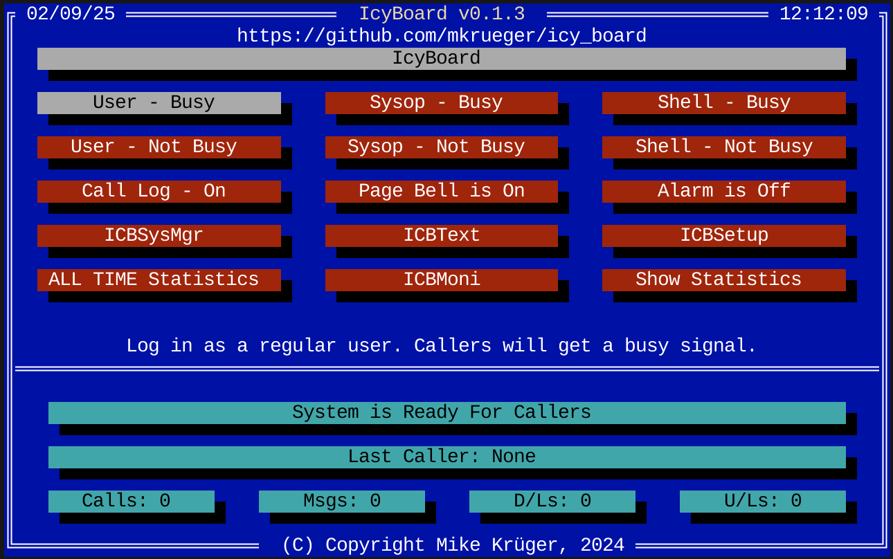

Icy Board
=========

Call Waiting Screen
-------------------

The call waiting screen is what you see when you start Icy Board. It's like the PCBoard call 
waiting screen but modernized a bit. All important Icy Board configuration utilities are accessible from here.

Options Explained
-----------------

User - Busy/Not Busy
~~~~~~~~~~~~~~~~~~~~

Log in as a regular user. This gets you to login prompt. 
You can log in as any user that exists in the users file.

Sysop - Busy/Not Busy
~~~~~~~~~~~~~~~~~~~~~~
Log in as sysop. This gets you to the command prompt directly.

Shell - Busy/Not Busy
~~~~~~~~~~~~~~~~~~~~~
Just quits the Call Waiting Screen. Historical reasons...

Call Log - On/Off
~~~~~~~~~~~~~~~~~
Toggle call logging. If on, all calls are logged to icboard.log.

Page Bell - On/Off
~~~~~~~~~~~~~~~~~~~
Toggle the page bell. If on, the terminal bell will ring when a user pages sysop

Alarm - On/Off
~~~~~~~~~~~~~~~~~~~~~~~
Toggle the alarm bell. If on, the terminal bell will ring when a user logs in.

ICBSM
~~~~~
Start the system manager utility. This is a TUI utility to manage users and groups.
Its menu carries the entries of the utility it replaces: besides the record editor
it sorts and packs the user file and runs the bulk edits over a selection of users -
security levels, expiration dates, conference registration and phone formats. The
screens ask the same questions in the same order, and PGDN starts the run as it did.
Security levels can also be handed out from a table of upload, download or ratio
steps; the tables are built from the same menu and kept in ``security_tables.toml``
next to the user file.
The entries the original spent on printer reports, index files and the user info
file have no equivalent here. Every operation that rewrites the file copies it
first, and ``Undo`` in the main menu puts that copy back.

The same operations run without a screen for cron jobs and timed events::

    icbsm --pack --inactive-days 365 --keep-security 100 --dry-run
    icbsm --standardize-phones
    icbsm --undo

``--dry-run`` lists the users that would be affected and writes nothing.
ICBSM takes the board lock while it runs, so it refuses to start when another
tool is already writing to the same board.

ICBText
~~~~~~~
Start the ICBText editor. This is a TUI utility to edit the system messages and prompts.

ICBSetup
~~~~~~~~
Start the setup utility. This is a TUI utility to create and configure an Icy Board
installation.

ICBMoni
~~~~~~~
Start the monitor utility. This is a TUI utility to monitor system activity.
Nodes & logged on users and which ports Icy Board is listening on.

Tools
-----

Icy Board includes a comprehensive suite of tools for BBS management and development:

**Core Executables**

* ``icboard`` - The BBS server and local call-waiting screen
* ``icbsetup`` - Terminal-based configuration and setup utility
* ``pplc`` - PPL compiler (source → PPE)
* ``ppld`` - PPL decompiler (PPE → source)
* ``mkicbtxt`` - Edit the system messages and prompts
* ``mkicbmnu`` - Edit menus
* ``icbsm`` - System manager utility (user/group editor)
* ``icbfile`` - File-base maintenance and import
* ``icbmailer`` - FTN mail scanning, polling and tossing
* ``icyboard-ppl`` - PPL language server for editors

Directory Layout
~~~~~~~~~~~~~~~~

I tried to simplify the PCBoard system a bit but it has limits.

A typical Icy Board installation follows this structure:

.. code-block:: text

   FOO/                    # Your BBS root (created by icbsetup)
   ├── icboard.toml        # Main configuration file
   ├── icboard.log         # Runtime log file
   ├── art/                # Graphics and art files
   │   └── help/           # Help Files
   ├── main/               # Main board files
   ├── conferences/        # Conference menus, files and message bases
   └── tmp/                # Generated Files for backwards compatibility

main/ files 
~~~~~~~~~~~

The ``main/`` directory contains core system configuration and data files:

**Configuration Files**

+------------------------+---------------------------------------------------------------+
| File                   | Description                                                   |
+========================+===============================================================+
| ``commands.toml``      | Command definitions and keyboard shortcuts                    |
| ``conferences.toml``   | Conference structure and access controls                      |
| ``languages.toml``     | Language definitions (date formats, yes/no chars, locale)     |
| ``protocols.toml``     | File transfer protocol configurations                         |
| ``security_levels.toml`` | Security level definitions and user limits                  |
+------------------------+---------------------------------------------------------------+

**User Management**

+------------------------+---------------------------------------------------------------+
| File                   | Description                                                   |
+========================+===============================================================+
| ``users.toml``         | User database with all registered accounts                    |
| ``groups``             | Unix-style groups file for permission management              |
| ``vip_user.txt``       | VIP users list (sysop notified on login)                      |
+------------------------+---------------------------------------------------------------+

**Security & Validation**

+------------------------+---------------------------------------------------------------+
| File                   | Description                                                   |
+========================+===============================================================+
| ``tcan_users.txt``     | Forbidden usernames (one per line)                            |
| ``tcan_passwords.txt`` | Forbidden passwords (weak/common passwords)                   |
| ``tcan_email.txt``     | Blocked email domains or addresses                            |
| ``tcan_uploads.txt``   | Prohibited upload filenames/patterns                          |
+------------------------+---------------------------------------------------------------+

**System Files**

+------------------------+---------------------------------------------------------------+
| File                   | Description                                                   |
+========================+===============================================================+
| ``icbtext.toml``       | System messages and prompts (customizable)                    |
|                        | Localized versions: ``icbtext_de.toml``, etc.                 |
| ``email.*``            | Email message base files (JAM format)                         |
+------------------------+---------------------------------------------------------------+

art/ files
~~~~~~~~~~

It is recommended to use ``.pcb``, ``.ans``, ``.rip`` and ``.asc`` extensions instead of the old ``@X`` naming scheme.
This makes it easier to draw files with an ansi 
drawing tool as well, and file-name lengths are no longer an issue.
Files can either be CP437 or UTF-8 - IcyBoard will do 
all conversions automatically. Note that UTF-8 requires the UTF-8 BOM.
This is by design it's the only way to make a 
fast and correct decision about the file encoding.

Note: UTF-8 is recommended for everything.

icbsetup
~~~~~~~~

``icbsetup`` is the interactive TUI (text user interface) utility
used to create, configure and maintain an Icy Board installation.  

It covers more than the classic setup utility.

* Create new BBS installations
* Import legacy PCBoard systems
* Help converting PPE plugins to modern systems
