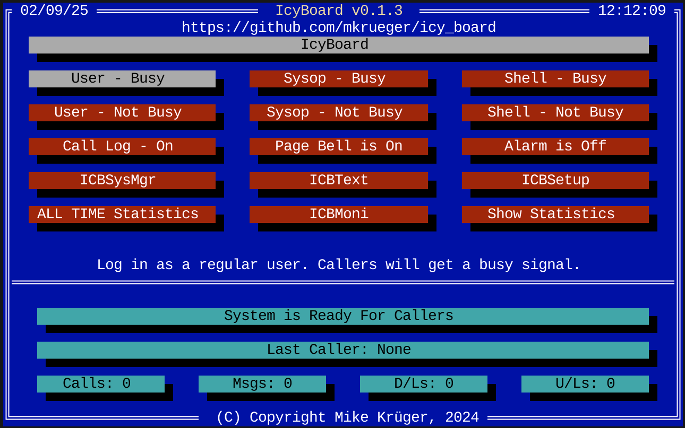

Introduction
=======================

Icy Board is a modern, memory-safe re-implementation of the classic
PCBoard Bulletin Board System.

Written in Rust—aiming to preserve the original experience while
enabling secure, scriptable expansion on today's platforms
(Linux, macOS, Windows, ARM, etc.).

Unlike emulation layers that just “run the old EXE”, 
Icy Board rebuilds core subsystems: 
user base, conferences, message storage (JAM),
time/byte bank, accounting scaffolding, PPL execution, and TUI
administration—providing a foundation that is both compatible *and*
extensible.

Key Goals
---------

* High compatibility with PCBoard 15.4 behaviors and PPE ecosystem
* Safe modernization: UTF-8, Internet protocols (Telnet, SSH, WebSockets)
* Preserve PCB / ANSI / Avatar / RIP aesthetics (nostalgia intact)
* Provide a fully featured PPL toolchain (compile, decompile, LSP)
* Make migration of legacy installations feasible
* Extend with new objects / APIs *without* breaking old PPE plugins

Non-Goals (by design)
---------------------

* “One-click shiny” out-of-box board—historical complexity retained
   * PCBoard was never simple; neither is IcyBoard
* Heavy GUI configuration (focus is terminal / SSH TUIs)
* Running on DOS / Windows 9x / OS/2

License
-------

Dual-licensed (Apache 2.0 / MIT) — see repository LICENSE files.

Building
--------

Prerequisites:
  * Rust toolchain (stable) — https://www.rust-lang.org/tools/install
  * A UTF‑8 capable terminal (most modern terminals)
  * (Optional) VS Code for PPL editing

Build everything:

.. code-block:: bash

   git clone https://github.com/mkrueger/icy_board.git
   cd icy_board
   cargo build --release

This will create a target/release/ directory with all executables.

Getting started
---------------

I recommend putting the bin/ directory in the path but you can just `cd bin` for now.

First create a new BBS: `./icbsetup create FOO`
Then start it: `./icboard FOO`

This will fire up a new call waiting screen where you can log in as sysop. By defaulut telnet is enabled on port 1337.

NOTE: Ensure that your terminal screen is big enough - 80x25 at least.

Tools
-----

Icy Board includes a comprehensive suite of tools for BBS management and development:

**Core Executables**

* ``icboard`` - The main BBS server daemon
* ``icbsetup`` - Terminal-based configuration and setup utility
* ``pplc`` - PPL compiler (source → PPE)
* ``ppld`` - PPL decompiler (PPE → source)
* ``mkicbtxt`` - Create/Edit ICBTXT files containing all strings used.
* ``icbsysmgr`` - System manager utility (user/group editor)
* ``ppl-language-server`` - Language server for PPL (for IDE integration)

Directory Layout
----------------

I tried to simplify the PCBoard system a bit but it has limits.

A typical Icy Board installation follows this structure:

.. code-block:: text

   FOO/                    # Your BBS root (created by icbsetup)
   ├── icboard.toml        # Main configuration file
   ├── icboard.log         # Runtime log file
   ├── users.toml          # User database
   ├── art/                # Graphics and art files
   │   └── help/           # Help Files
   ├── main/               # Main board files
   ├── conferences/        # Conference data
   └── tmp/                # Generated Files for backwards compatibility

main/ files 
-----------
The ``main/`` directory contains core system configuration and data files:

**Configuration Files**

+------------------------+---------------------------------------------------------------+
| File                   | Description                                                   |
+========================+===============================================================+
| ``commands.toml``      | Command definitions and keyboard shortcuts                   |
| ``conferences.toml``   | Conference structure and access controls                     |
| ``languages.toml``     | Language definitions (date formats, yes/no chars, locale)    |
| ``protocols.toml``     | File transfer protocol configurations                        |
| ``security_levels.toml`` | Security level definitions and user limits                |
+------------------------+---------------------------------------------------------------+

**User Management**

+------------------------+---------------------------------------------------------------+
| File                   | Description                                                   |
+========================+===============================================================+
| ``users.toml``         | User database with all registered accounts                   |
| ``groups``             | Unix-style groups file for permission management             |
| ``vip_user.txt``       | VIP users list (sysop notified on login)                    |
+------------------------+---------------------------------------------------------------+

**Security & Validation**

+------------------------+---------------------------------------------------------------+
| File                   | Description                                                   |
+========================+===============================================================+
| ``tcan_user.txt``      | Forbidden usernames (one per line)                          |
| ``tcan_passwords.txt`` | Forbidden passwords (weak/common passwords)                  |
| ``tcan_email.txt``     | Blocked email domains or addresses                           |
| ``tcan_uploads.txt``   | Prohibited upload filenames/patterns                         |
+------------------------+---------------------------------------------------------------+

**System Files**

+------------------------+---------------------------------------------------------------+
| File                   | Description                                                   |
+========================+===============================================================+
| ``icbtext.toml``       | System messages and prompts (customizable)                   |
|                        | Localized versions: ``icbtext_de.toml``, etc.               |
| ``email.*``            | Email message base files (JAM format)                        |
+------------------------+---------------------------------------------------------------+

art/ files
-----------

It's recommended to use .pcb, .ans, .rip, 
.asc extensions instead of the old *G, *R sheme. 
This makes it easier to draw files with an ansi 
drawing tool as well. And file name lengths ar no longer an issue.
Files can either be CP437 or UTF-8 - IcyBoard will do 
all conversions automatically. Note that UTF-8 requires the UTF-8 BOM.
This is by design it's the only way to make a 
fast and correct decision about the file encoding.

Note: UTF-8 is recommended for everything.

icbsetup
--------

`icbsetup` is the interactive TUI (text user interface) utility 
used to create, configure and maintain an Icy Board installation.  

It's more than the classic PCBoard PCBSETUP untility.

* Create new BBS installations
* Import legacy PCBoard systems
* Help converting PPE plugins to modern systems

Create new BBS installations
-----------------------------

1. Pick an identifier (letters / digits / underscore). Example: ``FOO``  
2. Create the instance:

   .. code-block:: bash

      ./icbsetup create FOO

3. Start it:

   .. code-block:: bash

      ./icboard FOO

Then the call waiting screen appears. You can access the setup or log in as user or sysop.

Import legacy PCBoard systems
-----------------------------

Icy Board can ingest an existing PCBoard installation directly from your original
``PCBOARD.DAT`` (plus the related files it references). The importer converts
binary/text formats into structured TOML, normalizes encodings to UTF-8 (with BOM
for display files), hashes passwords, and recreates conferences, commands,
security levels, protocols, colors, text resources, and user base metadata.

.. code-block:: bash

   ./icbsetup import /path/to/pcb /path/to/NEW_BBS_DIR

On success:

* Converted files populate ``NEW_BBS_DIR/``
* A log file is written to ``NEW_BBS_DIR/importlog.txt``
* You can start the board:

  .. code-block:: bash

     ./icboard /path/to/NEW_BBS_DIR

Limitations are that the importer may import wrong/old paths - they may need to be manually adjusted.
PPE plugins need to be manually converted as well.

Post-import tasks
------------------

1. See ``importlog.txt`` for warnings/errors (missing files, malformed records).
2. Manual convert PPE plugins (see below).
3. Test a migrated user:
   * Login
   * Read mail/conferences
   * Post a test message
4. Enable network services (telnet/ssh) only after verifying console launch works.

Converting PPE plugins to modern systems
----------------------------------------

Even if .PPE files don't need to be recompiled (they may work as-is) they may need to be adjusted to work with Icy Board.
Most of them have a configuration that hint to old paths or files that don't exist anymore. So they need to be manually adjusted.

I recommend lowercasing all filenames and paths - Icy Board is case-sensitive as well as converting all text files to UTF-8 with BOM.

WARNING: Backup your original PPE files before conversion!

For that icbsetup has a PPE conversion assistant:

  .. code-block:: bash
       ./icbsetup ppe-convert /path/to/ppe

This will lowercase all files and convert most fils from CP437 to UTF-8 with BOM. If a file is CP437 and is not converted.
(This is likely the case because there are plenty of text files with strange extensions).

Manual convert a single file with

   .. code-block:: bash
       ./icbsetup ppe-convert /path/to/file.nfo

This will convert a single CP437 file to UTF-8 with BOM. The PPE engine will automatically detect the encoding and convert to CP437 if needed.

.. toctree::
   :maxdepth: 2
   :caption: Contents:

   ppl

